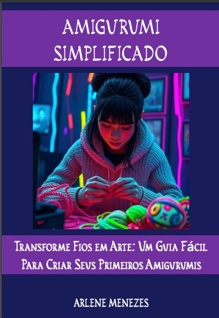

Projeto EBOOK Gerado por I.A.s (Projeto DIO)
Projeto com o objetivo de gerar um ebook digital com as facilidades das ferramentas de IA. todos os prompts seguem abaixo.

## Tecnologias utilizadas no projeto
- ChatGPT
- DALL·E 3 (OpenAI)
- PowerPoint

## ChatGPT

prompt:

Crie um titulo de um ebook sobre o tema de amigurumi, o ebook é do nicho crochê e o subnicho de amigurumi, o titulo deve ser chamativo, moderno e curto
e tenha uma temática de aprendizado e simbolos , me liste 8 variações de títulos

## DALL·E 3 (OpenAI)：

prompt:

Imagine uma mulher jovem fazendo crochê em um ambiente moderno.

## Features

- Conteúdo gerado via ChatGPT
- Imagens geradas via DALL·E 3 (OpenAI)
  

  
